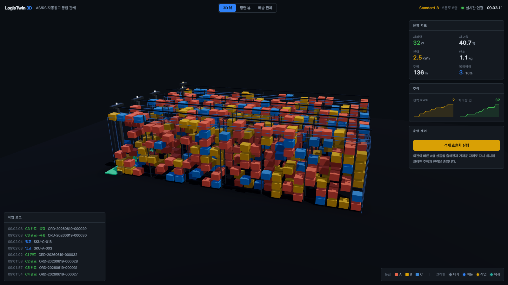
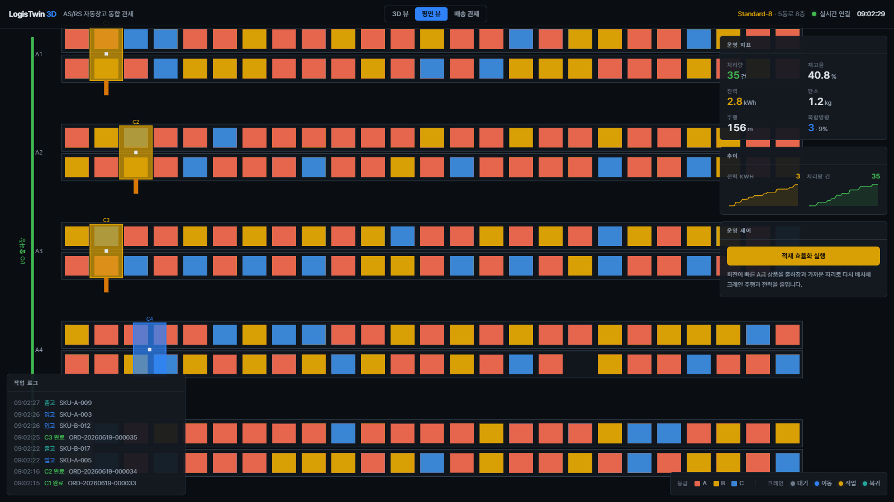
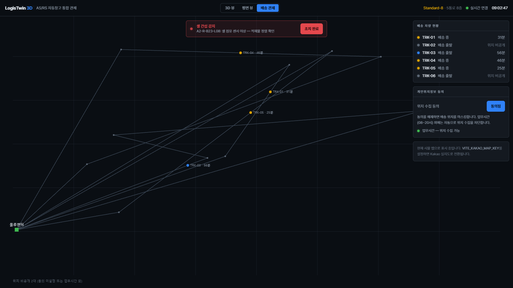
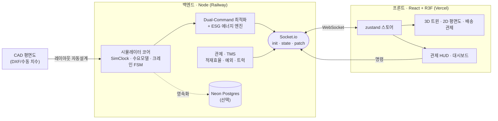

# LogisTwin 3D — 실시간 3D AS/RS 물류 디지털 트윈

스태커 크레인(AS/RS) 기반 고층 물류창고를 실시간으로 시뮬레이션하고, 3D로 시각화하며,
ESG·TMS 지표까지 통합 관제하는 디지털 트윈 플랫폼입니다.

> **Phase 1~6 구현 완료** — 백엔드 시뮬레이터 코어 · Dual-Command 최적화 · 3D/2D/지도 뷰 ·
> 관제 대시보드(적재효율·예외·ESG) · TMS 배송 관제 · 배포 설정. 배포 가이드: [docs/DEPLOY.md](docs/DEPLOY.md)

## 미리보기

| 3D 디지털 트윈 | 2D 평면도 | 배송 관제(TMS) |
| :---: | :---: | :---: |
|  |  |  |

> 실시간 크레인 주행/승강(보간), 적재 효율화·예외 경보, ESG 지표, 가상 트럭 추적까지
> 한 화면에서 관제. 상단 토글로 3D / 평면 / 배송 뷰 전환.

---

## 개요

현장의 실데이터 부재를 극복하기 위해, 백엔드에서 자체 **물류 시뮬레이터 엔진**을 가동합니다.
**3차원 고층 랙 자료구조**, **스스로 돌아가는 주문 생태계**, 그 주문을 처리하는
**스태커 크레인 상태 머신**, 그리고 공차 주행을 최소화하는 **복합 명령(Dual Command) 최적화**까지 구현합니다.

### 핵심 기능

| 기능 | 설명 |
| --- | --- |
| 🏗️ **3D AS/RS 스키마** | `Aisle(통로) × Side(L/R) × X(베이) × Z(8층)` 고층 랙 배열. 셀마다 미터 단위 `position` 보유 → 3D 렌더 & 거리/에너지 연산 |
| 🔗 **Dual-Command 최적화** | 입고 적재 후 빈손 복귀 대신 같은 통로 출고를 연계 추출. **Travel-Between(TB) 최소** 페어링 → **주행 34.5%·전력 31% 절감** (아래 벤치마크) |
| 🤖 **크레인 상태 머신** | 통로당 크레인 1대(총 5대). `대기→이동→적재/추출→복귀` 4상태 FSM. 셀 예약으로 중복 배정 방지, dwell 정책으로 페어링 기회 확보 |
| 📐 **체비쇼프 이동 모델** | 수평(주행)·수직(승강) **동시 구동** 시간 = `max(수평/Vh, 수직/Vv)` — AS/RS 표준 가정 |
| 🌱 **ESG 에너지 엔진** | 수평/수직 주행거리 → kWh → 탄소배출(kgCO₂) 환산. Single vs Dual 절감 정량화 |
| 🕒 **시뮬레이션 클록 + 시간 가속** | 틱 기반 가상 시계. `--speed=1/10/100`으로 하루치 운영을 몇 분에 압축 재현 |
| 📈 **현실적 수요 모델** | 포아송 분포 주문 도착 + ABC 80/20 인기도(파레토) + 시간대별 피크(오전 입고/오후 출고) |
| 🎲 **결정론적 시드** | 시드 기반 PRNG → 동일 시드 = 동일 시뮬레이션 (크레인 처리까지 완전 재현 → 공정한 A/B 비교) |
| 🧾 **이벤트 소싱 로그** | 모든 주문·완료 이벤트를 `logs/events-<seed>.jsonl`에 append → PostgreSQL 적재 / 리플레이 대비 |
| 📊 **실시간 KPI 집계기** | 생성/완료 처리량 · 큐 깊이 · 적재율 · 크레인 가동률 · 주행거리 · 전력 |

---

## 🔗 Dual-Command 최적화 (간판 지표)

**문제:** 단일 명령(Single Command)은 매 사이클에 입고 또는 출고 1건만 처리해, 절반의 주행이
**공차(빈손) 주행**입니다. **복합 명령(Dual Command)**은 적재 직후 같은 통로의 출고를 이어
추출해 한 사이클에 2건을 처리 → 중복 복귀를 제거합니다.

**알고리즘:** 적재 셀과 출고 셀 사이의 **Travel-Between(TB) 거리**를 최소화하도록 페어링하면
절감이 극대화됩니다 (삼각부등식: 절감 = `d(IO,적재) + d(IO,출고) − TB`). dwell 정책으로
크레인이 바쁠 때 혼합 백로그를 형성해 페어링률을 끌어올립니다.

**벤치마크** (`npm run compare -- --seed=42 --ticks=7200 --rate=20`, 동일 트레이스 2,386건 A/B):

| 지표 | Single | Dual | 절감 |
| --- | ---: | ---: | ---: |
| 명령당 주행거리 | 15.8 m | 10.3 m | **▼ 34.5%** |
| 전력 소모 | 584 kWh | 403 kWh | **▼ 31.0%** |
| 탄소 배출 | 258.5 kgCO₂ | 178.4 kgCO₂ | **▼ 31.0%** |
| 페어링률 | — | 55% | — |

> 절감폭은 부하 의존적입니다(혼합 백로그가 클수록 페어링↑). 위는 피크 부하(20/분) 기준이며,
> 이론 상한과 일치합니다: **E[DC] < 2·E[SC]**, 거래당 ~25–30% 절감 (Bozer & White, 1984).

---

## 빠른 시작

```bash
npm install                              # 외부 의존성 없음 (초기화 용도)
npm start                                # 라이브 디지털 트윈 (기본 Dual Command)

# 라이브 옵션
npm run sim -- --seed=42 --speed=100     # 재현 가능 + 100배속
npm run sim -- --mode=single             # 단일 명령으로 대비 관찰

# Single vs Dual 정량 비교 (헤드리스, 결정론적)
npm run compare -- --seed=42 --ticks=7200 --rate=20

# 실시간 WebSocket 서버 (프론트엔드/3D 뷰포트용)
npm run serve                            # http://localhost:3001 (health: /health)
npm run ws:test                          # 스모크 테스트 클라이언트 (init/state 수신 확인)

# 평면도 → AS/RS 레이아웃 자동 설계 (CAD 임포트)
npm run import-layout -- --dxf samples/floorplan.dxf --height 9 --name "Incheon DC"
npm run import-layout -- --width 60 --depth 35 --height 8   # PDF/이미지: 치수 수동 입력
npm start -- --layout=generated/incheon-dc.layout.json      # 생성된 레이아웃으로 시뮬

# 크레인 제원 선택 투입
npm start -- --crane=highbay              # compact | standard | highbay | heavyduty
```

### 3D 디지털 트윈 뷰포트 (프론트엔드, `web/`)

React + `@react-three/fiber`로 백엔드 WebSocket을 구독해 랙·팔레트·크레인을 실시간 3D 렌더하고
KPI/ESG를 HUD로 표시합니다. 크레인은 절차적 모델(보간 애니메이션)이며 `modelRef`로 실사 glTF 교체 대비.

```bash
# 1) 백엔드 WebSocket 서버
npm run serve                             # http://localhost:3001

# 2) 프론트엔드 (별도 터미널)
cd web && npm install && npm run dev      # http://localhost:5173
```
배포 시 프론트는 `VITE_WS_URL`로 백엔드(Railway) 주소를 주입합니다.

`Ctrl+C` 로 종료하면 최종 KPI·ESG 요약을 출력하고 이벤트 로그를 flush합니다.

### WebSocket 실시간 파이프라인

`npm run serve`는 시뮬레이터를 가동하며 Socket.io로 매 틱 상태를 브로드캐스트합니다:
- **`init`** (접속 시 1회): 창고 레이아웃(config) + 점유 셀 + 크레인 + KPI
- **`state`** (매 틱): 크레인 **보간 좌표**(부드러운 3D 애니메이션용) · 상태 · 적재 여부,
  셀 점유 변화(delta), 신규/완료 주문, 사이클(SINGLE/🔗DUAL), KPI·ESG(kWh/CO₂)

환경변수: `PORT`(기본 3001) · `CORS_ORIGIN` · `SIM_SPEED`(기본 1) · `SIM_SEED` · `SIM_MODE`.
Railway 배포 시 `PORT` 자동 주입 + `/health` 헬스체크 대응.

---

## 아키텍처



```
src/
├─ config/
│  ├─ warehouse.config.js   # 창고 치수·셀 크기·입출하장 (추후 CAD 도면 수치로 교체)
│  ├─ sim.config.js         # 시드·배속·수요율(λ)·시간대 프로파일·초기 적재율
│  └─ crane.config.js       # 크레인 동역학 (주행/승강 속도, 포크 시간, 홈 위치)
├─ data/
│  ├─ skuMaster.js          # ABC 등급 + 인기도 가중치가 포함된 SKU 마스터
│  └─ craneModels.js        # 제원별 크레인 카탈로그 (선택 투입 + 3D 에셋 참조)
├─ sim/
│  ├─ rng.js                # 시드 PRNG (mulberry32): random/int/pick/weightedPick/poisson
│  ├─ clock.js              # SimClock: 틱 기반 가상 시각 + 배속 (+ 헤드리스 tickOnce)
│  ├─ demandModel.js        # 포아송 도착 + ABC 가중 SKU + 시간대 IN/OUT 비율
│  └─ bootstrap.js          # assembleCore() — 코어 조립 (index/compare 공유)
├─ models/
│  ├─ warehouse.js          # 3D 랙 배열 생성 + 셀 스키마 + 예약 + 거리 헬퍼
│  ├─ order.js              # 주문 팩토리 + 스키마 상수 (IN/OUT, 상태)
│  ├─ task.js               # 명령 사이클 작업 (Single store/retrieve, Dual)
│  └─ crane.js              # 크레인 4상태 FSM (태스크→스텝 플랜 실행기)
├─ services/
│  ├─ orderGenerator.js     # 클록·수요모델 결합 주문 엔진 (EventEmitter)
│  ├─ dispatcher.js         # 셀 할당 + Dual 페어링(TB 최소) + 크레인 플릿 오케스트레이션
│  └─ eventLog.js           # JSONL 이벤트 소싱 라이터
├─ metrics/
│  ├─ kpi.js                # 실시간 KPI 집계기 (처리량/적재율/주행/전력)
│  └─ energy.js             # ESG 에너지 모델 (주행거리 → kWh → kgCO₂)
├─ cad/
│  ├─ layout.design.js      # AS/RS 설계 규칙 (통로폭·랙깊이·베이피치·층고)
│  ├─ layoutGenerator.js    # 건물 외곽 → 랙 레이아웃(통로×베이×층) 자동 설계
│  ├─ dxfParser.js          # DXF 평면도 → 외곽 치수(bbox) + 기둥 추출
│  └─ importLayout.js       # 임포트 CLI (DXF 자동 / 수동 치수)
├─ utils/ids.js             # 주문/셀 ID 생성
├─ index.js                 # 라이브 콘솔 부트스트랩 (조립 + 배선 + 우아한 종료)
├─ server.js                # 실시간 WebSocket 서버 (Socket.io: init/state 브로드캐스트)
└─ compare.js               # Single vs Dual 정량 비교 하네스 (헤드리스)

scripts/wsClient.js         # WebSocket 스모크 테스트 클라이언트
samples/floorplan.dxf       # 예시 평면도 (80×45m, 임포트 데모용)
```

## 🏗️ 평면도 → AS/RS 레이아웃 자동 설계

받은 도면은 **랙이 없는 기본 평면도(건물 외곽)** 이므로, 임포트 유틸은 외곽 치수를 읽어
그 footprint에 들어가는 AS/RS 랙 레이아웃(통로 수 × 베이 × 층)을 **자동 설계**합니다.
단면 반복 단위 = `통로폭 + 2 × 랙깊이`, 건물 폭/깊이/천장고로 통로·베이·층수를 산출.

- **DXF**: 외곽선·치수 자동 추출 (`--dxf`). **DWG**: DXF로 변환 후 동일 처리.
  **PDF/이미지**: 치수만 보고 `--width/--depth/--height` 수동 입력.
- 산출물: 저장 셀 수 · 저장 밀도(셀/m²) · 공간 활용률 + `warehouse.config` 호환 JSON
  → `npm start -- --layout=...` 또는 `LAYOUT=... npm run serve`로 즉시 시뮬레이션.
- 예: 80×45m·H9m → **20통로 × 30베이 × 8층 = 9,600셀, 활용률 87%**.

## 🏗️ 크레인 제원 카탈로그 (선택 투입)

제원이 다른 크레인 모델을 [craneModels.js](src/data/craneModels.js)에 정의하고 선택 투입합니다.
선택 제원이 이동 시간·처리량·에너지에 직접 반영되어 **장비 선택에 따른 운영 성과**를 비교할 수 있습니다.

| 모델 | 등급 | 주행 | 승강 | 포크 | 최대 층 |
| --- | --- | ---: | ---: | ---: | ---: |
| Compact-6 | 저층·고속 | 4.0 m/s | 1.2 m/s | 6 s | 6 |
| Standard-8 | 표준 | 2.0 m/s | 1.0 m/s | 8 s | 8 |
| HighBay-12 | 초고층 | 3.0 m/s | 0.9 m/s | 9 s | 12 |
| HeavyDuty-10 | 중량물 | 2.0 m/s | 0.6 m/s | 12 s | 10 |

- `--crane=<id>`로 선택. 모델 **최대 층수 < 레이아웃 층수**면 부적합으로 거부(투입 전 검증).
- 각 모델은 3D 치수 + `modelRef`(glTF)를 보유 → **Phase 3에서 제원별 실사 3D 모델**을 매핑해 렌더.
  WebSocket `init`이 선택 모델 정보를 함께 전달합니다.

## 배포 스택 (예정)

| 레이어 | 플랫폼 |
| --- | --- |
| 프론트엔드 (React/R3F) | **Vercel** |
| 백엔드 (sim 엔진 + WebSocket) | **Railway** (상시 프로세스 + WS) |
| DB (물류 트랜잭션) | **Neon** (서버리스 PostgreSQL) |

## 로드맵 (이후 단계)

- **Phase 2 (완료)** — Dual-Command 최적화 · ESG 에너지 엔진 · WebSocket 브로드캐스팅
- **Phase 3 (완료)** — R3F 3D 디지털 트윈 + 2D 평면도 뷰 + 상세 크레인(절차적, glTF 교체 대비)
- **Phase 4 (완료)** — 관제 대시보드: 적재 효율화(Slotting)·예외 경보/조치·ESG 추이 차트
- **Phase 5 (완료)** — TMS 배송 관제: 가상 트럭 추적(Kakao/시뮬 맵) + 위치정보 컴플라이언스
- **Phase 6 (완료)** — 배포 설정: Dockerfile·Railway·Vercel·GitHub Actions CI · Neon DB(env 게이트)

> 후속 고도화 여지: 제원별 실사 glTF 크레인 모델, Kakao 실지도 키 연동, 라이브 배포.

## 참고 문헌

- Bozer, Y.A. & White, J.A. (1984). *Travel-Time Models for Automated Storage/Retrieval Systems.* IIE Transactions, 16(4), 329–338.
- Roodbergen, K.J. & Vis, I.F.A. (2009). *A survey of literature on automated storage and retrieval systems.* European Journal of Operational Research, 194(2), 343–362.
- Lerher, T. et al. (2017). *Energy efficiency model for the mini-load AS/RS* — 회생제동 기반 에너지 절감 (ESG 프레이밍).
